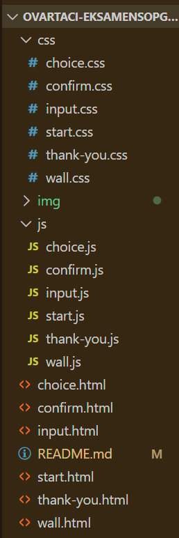
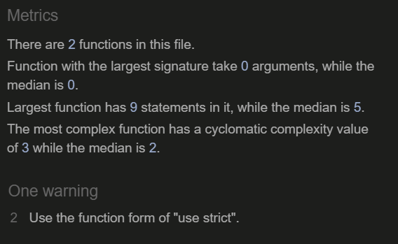
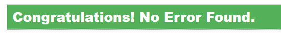
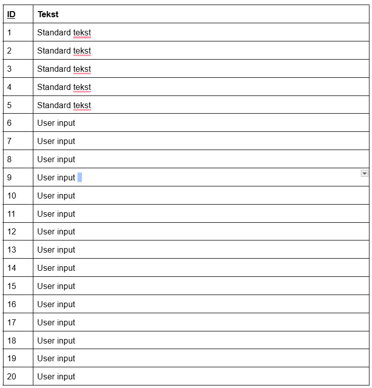
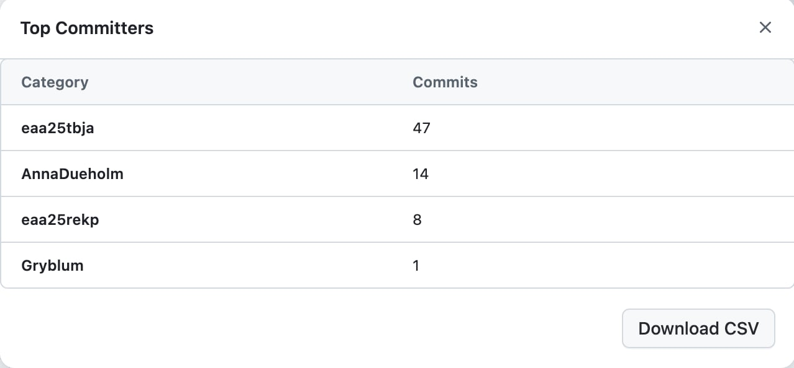

# README

Dette procesdokument er udarbejdet af **Thilde Bisgaard Jakobsen** som en del af eksamensprojektet _"Sæt et aftryk"_ for Ovartaci Museet.

Løsningen giver museumsgæster mulighed for anonymt at dele tanker, følelser og historier, som bliver vist på en digital væg.

## Indhold

1. Om projektet
2. Filstruktur, kodestandarder og validering
   - HTML-sider
   - Kode-standarder
   - Navngivning
   - CSS-struktur
   - Validering
3. ORCA & datastruktur
   - ORCA
   - defaultStories array
   - Datatyper
4. Centrale funktioner
   - Mikrointeraktioner
   - localStorage
   - Håndtering af fyldt væg
   - JSON.parse & JSON.stringify
   - filter()
   - map() og join()
   - Template literals, inline styling & innerHTML
   - toLowerCase()
5. Styling i CSS
   - :root
   - Global reset
   - Layout
   - Keyboard
   - Væggen
   - Stories
   - Animationer
6. Samarbejde
   - Commits

# Filstruktur, kodestandarder og validering

Projektet er opdelt efter separation of concerns, hvor HTML, CSS og JavaScript er organiseret i separate mapper:

- **css/** indeholder styling til de forskellige sider.
- **js/** indeholder funktionalitet og interaktioner for de forskellige sider.
- **img/** indeholder billeder og grafiske elementer.
- **HTML-filerne** udgør projektets forskellige skærme og brugerflow.
- **README.md** indeholder dokumentation af projektet.



## HTML-sider

- index.html
  Projektets startside.

- choice.html
  Giver brugeren mulighed for at vælge, hvordan de ønsker at deltage.

- input.html
  Indeholder input-felt, hvor brugeren kan indtaste sin historie.

- confirm.html
  Viser en forhåndsvisning af historien og giver mulighed for at bekræfte indsendelsen.

- thank-you.html
  Bekræfter at historien er blevet indsendt.

- wall.html
  Viser alle historier på den projicert væg.

Alle html sider har hertil en respektiv js- og css-fil, med samme navn, for at gøre kodeprocessen så overskuelig som mulig

## Kode-standarder

- For at skabe en overskuelig og vedligeholdelsesvenlig kodebase er der anvendt fælles kodestandarder gennem hele projektet. Filnavne skrives med små bogstaver, uden æ,ø og å, variabel- og funktionsnavne følger camelCase-konventionen, og koden er skrevet på engelsk. Derudover anvendes kommentarer til at forklare centrale dele af funktionaliteten, og koden er struktureret konsekvent på tværs af HTML-, CSS- og JavaScript-filer.

### Navngivning

- For at skabe en overskuelig og vedligeholdelsesvenlig kodebase er der anvendt konsekvente navngivningskonventioner på tværs af projektet.

- Id'er og klasser navngives ud fra deres funktion og den side, de tilhører. Eksempelvis benyttes id'et `input-back-btn` til tilbageknappen på `input.html`, mens tilsvarende elementer på andre sider navngives efter samme princip. Dette gør det lettere at identificere elementers placering og funktion i projektet.

```html
<button id="input-back-btn">↩</button>
<button id="confirm-back-btn">↩</button>
<button id="choice-back-btn">↩</button>
```

## CSS-struktur

- For at sikre et ensartet design på tværs af hele prototypen er der anvendt CSS-variabler i `:root`. Variablerne bruges til centrale designvalg som farver, typografi, fontstørrelser og størrelsen på tilbageknappen.

```css
:root {
  --text-color: #402924;
  --bg-color: #fffaee;
  --font: "Inter", sans-serif;

  --font-size-l: 2.5rem;
  --font-size-m: 2rem;
  --font-size-s: 1rem;

  --font-weight-l: 600;
  --font-weight-s: 400;

  --back-btn-size: 60px;
}
```

- De samme variabler anvendes på tværs af projektets CSS-filer, hvilket sikrer et ensartet udtryk og gør det lettere at vedligeholde og justere designet gennem kodeprocessen.

## Validering

- Alle html-filer er valideret gennem https://validator.w3.org, med enkelte warnings
  

- Alle js-filer er valideret gennem https://jshint.com/, med en enkelt warning om brugen af "use strict"
  

- Alle css-filer er valideret gennem https://jigsaw.w3.org/css-validator/validator, med enkelte warnings
  

# ORCA & datastruktur

## ORCA

- For at beskrive datastrukturen er der udarbejdet en ORCA-model for objektet Story. Objektet indeholder attributterne id og text, som bruges til henholdsvis identifikation af historien og lagring af dens indhold.
  

- ORCA-modellen er implementeret gennem objektet `Story` i JavaScript.

```js
{
  id: 1,
  text: "Min mor kæmpede med depression det meste af min barndom."
}
```

## defaultStories array

- Projektet anvender et array kaldet defaultStories til at håndtere de historier, der vises på væggen. Arrayet består af 20 objekter, hvor hvert objekt indeholder et unikt id og en tilhørende text-værdi.

- De første fem objekter indeholder forhåndsdefinerede eksempelhistorier, som sikrer, at væggen har indhold ved opstart. Objekterne med id 6–20 fungerer som pladser til besøgendes indsendte historier. Når en bruger indsender en historie, gemmes den i den første ledige plads og lagres i browserens Local Storage.

```js
const defaultStories = [
  {
    id: 1,
    text: "Min mor kæmpede med depression det meste af min barndom.",
  },

  {
    id: 2,
    text: "Jeg føler mig alene, selv når jeg er omgivet af mennesker.",
  },

  {
    id: 3,
    text: "Min bror fik skizofreni som teenager.",
  },

  {
    id: 4,
    text: "Jeg ville ønske folk forstod hvor trættende angst er.",
  },

  {
    id: 5,
    text: "Jeg lærte tidligt at skjule mine følelser.",
  },

  { id: 6, text: "" },
  { id: 7, text: "" },
  { id: 8, text: "" },
  { id: 9, text: "" },
  { id: 10, text: "" },
  { id: 11, text: "" },
  { id: 12, text: "" },
  { id: 13, text: "" },
  { id: 14, text: "" },
  { id: 15, text: "" },
  { id: 16, text: "" },
  { id: 17, text: "" },
  { id: 18, text: "" },
  { id: 19, text: "" },
  { id: 20, text: "" },
];
```

## Datatyper

Projektet anvender flere forskellige JavaScript-datatyper til håndtering af historier og brugerinput.

| Variabel       | Datatype | Beskrivelse                                 |
| -------------- | -------- | ------------------------------------------- |
| defaultStories | Array    | Indeholder alle historieobjekter            |
| story          | Object   | Repræsenterer en enkelt historie            |
| id             | Number   | Unik identifikator for en historie          |
| text           | String   | Historiens indhold                          |
| pendingStory   | String   | Midlertidigt gemt brugerinput               |
| currentIndex   | Number   | Holder styr på næste ledige plads i arrayet |
| filledStories  | Array    | Indeholder kun historier med tekst          |

# Centrale funktioner

## Mikrointeraktioner

Løsningen indeholder flere mikrointeraktioner implementeret gennem JavaScript-events

- click på send-knap
- click på confirm-knap
- click på tilbage-knapper
- click på tastaturknapper
- automatisk visning af fejlbeskeder ved tomt input

eks.

```js
// Her henter jeg tilbage-knappen fra html
const backButton = document.querySelector("#input-back-btn");

// Her lytter jeg efter klik på tilbage-knappen
backButton.addEventListener("click", () => {
  // Her sendes brugeren tilbage til input-siden
  window.location.href = "choice.html";
});
```

## localStorage

- Projektet anvender `localStorage` til at gemme brugerens historier direkte i browseren. Dette gør det muligt at bevare historierne, selvom siden genindlæses. Der gemmes blandt andet et stories-array, en midlertidig `pendingStory` samt et `currentIndex`, der holder styr på, hvor den næste historie skal placeres.

```js
button.addEventListener("click", () => {
  // Her gemmes brugerens input i en variabel
  const userText = input.value.trim();

  // Hvis inputfeltet er tomt,
  // vises en fejlbesked
  if (userText === "") {
    errorMessage.textContent = "Inputfeltet er tomt.";
    return;
  }

  // Her fjernes fejlbeskeden igen
  errorMessage.textContent = "";

  // Her gemmes brugerens besked midlertidigt i localStorage
  localStorage.setItem("pendingStory", userText);

  // Her sendes brugeren videre til confirm-siden
  window.location.href = "confirm.html";
});
```

- I dette kodeeksempel anvendes Local Storage til midlertidigt at gemme brugerens indtastede historie. Når brugeren klikker på send-knappen, gemmes teksten under nøglen "pendingStory", så den kan hentes igen på bekræftelsessiden confirm.html På den efterfølgende side hentes historien igen med:

```js
const pendingStory = localStorage.getItem("pendingStory");
```

### Håndtering af fyldt væg

- Når en bruger bekræfter sin historie, gemmes den i `stories`-arrayet. Variablen `currentIndex` bruges til at holde styr på, hvilken plads den næste historie skal indsættes på.

- Da de første fem historier er faste standardhistorier, starter indsættelsen ved `id: 6`. Når den sidste plads (`id: 20`) er nået, starter systemet forfra ved plads 6 og overskriver de ældste brugerhistorier.

```js
// Her henter vi tallet for, hvilken plads næste besked skal indsættes på.
// Hvis der ikke findes et tal endnu, starter den ved 6,
// fordi id 1-5 er faste historier.
let currentIndex = Number(localStorage.getItem("currentIndex")) || 6;

// Her indsætter vi brugerens besked i arrayet.
// Arrays starter på 0, men vores id'er starter på 1.
stories[currentIndex - 1].text = pendingStory;

// Her tæller vi én op, så næste bruger går videre til næste plads.
currentIndex++;

// Hvis currentIndex bliver større end 20,
// starter den forfra ved plads 6.
if (currentIndex > 20) {
  currentIndex = 6;
}

// Her gemmes den nye plads i localStorage.
localStorage.setItem("currentIndex", currentIndex);

// Her gemmes det opdaterede stories-array i localStorage.
localStorage.setItem("stories", JSON.stringify(stories));
```

## JSON.parse & JSON.stringify

- Da Local Storage kun kan gemme tekststrenge, anvendes `JSON.stringify()` til at konvertere JavaScript-arrays og objekter til tekst, før de gemmes. Når dataene skal hentes igen, anvendes `JSON.parse()` til at omdanne teksten tilbage til JavaScript-objekter og arrays.

```js
localStorage.setItem("stories", JSON.stringify(stories));

const stories = JSON.parse(localStorage.getItem("stories")) || defaultStories;
```

## filter()

- Metoden `filter()` bruges til at gennemgå historie-arrayet og fjerne tomme historier. På den måde vises kun historier, der indeholder tekst, på væggen.

```js
const filledStories = stories.filter((story) => {
  return story.text !== "";
});
```

## .map og .join

- `map()` anvendes til at omdanne hvert historieobjekt til HTML. Resultatet bliver et nyt array bestående af HTML-strings. Herefter samler `join()` alle strings til én samlet HTML-string.

```js
const html = filledStories
  .map((story) => {
    return `<p>${story.text}</p>`;
  })
  .join("");
```

## template literals, inline styling & innerHTML

- I funktionen `displayStories()` anvendes template literals til at generere HTML ud fra de historier, der findes i arrayet. Ved hjælp af `${}` indsættes både historiens tekst og CSS-værdier direkte i HTML-strukturen.

- Der anvendes samtidig inline styling til at give hver historie en tilfældig placering, bredde, animationshastighed og baggrundsfarve.

- Funktionen `Math.random()` anvendes til at skabe variation i præsentationen af historierne på væggen. Her bruges den til at skabe variation i: background-color, animation-delay, animation duration, max-width på tekst-boblen, og placeringen af boblen på hhv. x og y-aksen

```js
return `
  <p
    class="story-text"
    style="
      left: ${Math.random() * 80}%;
      top: ${Math.random() * 80}%;
      max-width: ${400 + Math.random() * 500}px;
      animation-duration: ${30 + Math.random() * 40}s;
      animation-delay: -${Math.random() * 30}s;
      background-color: ${Math.random() < 0.5 ? "#C2B679BD" : "#9F8E96BD"};
    "
  >
    ${story.text.toLowerCase()}
  </p>
`;
```

- Den genererede HTML gemmes i variablen html og indsættes derefter i wall-containeren ved hjælp af `innerHTML`, så historierne bliver vist på siden.

```js
wall.innerHTML = html;
```

## .toLowerCase

- Metoden toLowerCase() anvendes ved visning af historierne for at sikre, at alt tekst vises med små bogstaver. Dette giver et ensartet visuelt udtryk på væggen, uanset hvordan brugeren har skrevet sin historie.

```js
${story.text.toLowerCase()}
```

# Styling i CSS

## :root

- Projektets CSS er opbygget med fokus på et ensartet visuelt udtryk på tværs af siderne. Der anvendes CSS-variabler i :root til blandt andet farver, fonte, skriftstørrelser, font-weight og størrelsen på tilbage-knapper. Det gør det lettere at genbruge de samme værdier på flere sider og ændre designet samlet ét sted.

eks.

```css
:root {
  --text-color: #402924;
  --bg-color: #fffaee;
  --font: "Inter", sans-serif;

  --font-size-l: 2.5rem;
  --font-size-m: 2rem;
  --font-size-s: 1rem;

  --font-weight-l: 600;
  --font-weight-s: 400;
  --back-btn-size: 60px;
}
```

## Global reset

- Der anvendes en global reset (`*`) i projektet, hvor `margin` og `padding` sættes til `0`, og `box-sizing` sættes til `border-box`. Dette giver et mere ensartet udgangspunkt for stylingen på tværs af browsere.

## Layout

- Siderne er primært opbygget med Flexbox. Det bruges blandt andet til at centrere indhold og skabe struktur på de forskellige skærme i løsningen, såsom startside, valgside, inputside og bekræftelsesside.

## Keyboard

- På input-siden er der udviklet et virtuelt tastatur. Tastaturet er stylet med egne klasser til taster og rækker, og tasterne har en hover-effekt, som giver visuel feedback, når brugeren interagerer med dem.

## Væggen

- Væggen er bygget op omkring containeren `#wall`, som fylder hele skærmen. Historierne placeres frit på væggen ved hjælp af `position: absolute`, mens `overflow: hidden` sikrer, at indhold uden for skærmen ikke vises.

## Stories

- Historierne vises med klassen `.story-text`. De er designet med afrundede former, gennemsigtighed og lyse tekstfarver for at passe til installationens visuelle udtryk.
- Placering, størrelse, animationshastighed og baggrundsfarve genereres gennem JavaScript.

## Animationer

- For at skabe liv på væggen anvendes animationen `float`, som får historierne til langsomt at bevæge sig op gennem skærmen.

```css
@keyframes float {
  0% {
    transform: translateY(100vh);
  }

  100% {
    transform: translateY(-120vh);
  }
}
```

Animationen tilknyttes hvert historieelement gennem klassen `.story-text`

# Samarbejde

- Projektet er udviklet i fællesskab, hvor gruppen løbende har samarbejdet om struktur, funktionalitet og opsætning af koden. Til versionsstyring har vi anvendt GitHub, hvor alle gruppemedlemmer har været tilføjet som collaborators på repositoryet.

- I den indledende fase arbejdede vi sammen om at udvikle sidernes struktur og funktionalitet.Efterfølgende forsøgte vi at opdele siderne mellem os, så hver person stod for styling af sine egne sider. Denne arbejdsmetode viste sig dog at skabe udfordringer, da siderne fik forskellige strukturer, hvilket gjorde det sværere at opnå et ensartet design.

- Derfor valgte vi at starte stylingarbejdet forfra og samle ansvaret hos én person. På den måde blev det lettere at bevare et fælles visuelt udtryk, genbruge CSS-komponenter og oprette varabler.

## Commits

- Vi har anvendt GitHub til versionsstyring og samarbejde om projektet. Undervejs har vi løbende oprettet commits for at gemme ændringer i kodebasen. Vi har forsøgt at skrive beskrivende commit-beskeder, så udviklingsprocessen var lettere at følge, men kvaliteten har varieret, og nogle commits kunne have været mere præcise.

Her ses fordelingen af commits:

