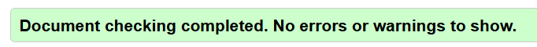

# Om projektet

"Sæt et aftryk" er en interaktiv installation udviklet til Ovartaci Museet.

Løsningen giver museumsgæster mulighed for anonymt at dele tanker, følelser og historier, som bliver vist på en digital væg.

# KODE

## Struktur

### Mappe struktur og filnavne

```
OVARTACI-EKSAMENSOPGAVE
│
├── css/
│   ├── choice.css
│   ├── confirm.css
│   ├── input.css
│   ├── start.css
│   ├── thank-you.css
│   └── wall.css
│
├── img/
│   └── Projektets billeder og grafiske elementer
│
├── js/
│   ├── choice.js
│   ├── confirm.js
│   ├── input.js
│   ├── start.js
│   ├── thank-you.js
│   └── wall.js
│
├── choice.html
├── confirm.html
├── input.html
├── start.html
├── thank-you.html
├── wall.html
│
└── README.md
```

Projektet er opdelt efter separation of concerns, hvor HTML, CSS og JavaScript er organiseret i separate mapper:

- **css/** indeholder styling til de forskellige sider.
- **js/** indeholder funktionalitet og interaktioner for de forskellige sider.
- **img/** indeholder billeder og grafiske elementer.
- **HTML-filerne** udgør projektets forskellige skærme og brugerflow.
- **README.md** indeholder dokumentation af projektet.

HTML-sider:

- start.html
  Projektets startside.

- choice.html
  Giver brugeren mulighed for at vælge, hvordan de ønsker at bidrage.

- input.html
  Indeholder formularen, hvor brugeren kan indtaste sin historie.

- confirm.html
  Viser en forhåndsvisning af historien og giver mulighed for at bekræfte indsendelsen.

- thank-you.html
  Bekræfter at historien er blevet indsendt.

- wall.html
  Viser alle historier på den projicert væg.

Kode-standarder:

- For at skabe en overskuelig og vedligeholdelsesvenlig kodebase er der anvendt fælles kodestandarder gennem hele projektet. Filnavne skrives med små bogstaver, variabel- og funktionsnavne følger camelCase-konventionen, og koden er skrevet på engelsk. Derudover anvendes kommentarer til at forklare centrale dele af funktionaliteten, og koden er struktureret konsekvent på tværs af HTML-, CSS- og JavaScript-filer.

Validering:

Alle html-filer er valideret gennem https://validator.w3.org, med enkelte warnings


Alle js-filer er valideret gennem https://jshint.com/, med en enkelt warning om brugen af "use strict"


Alle css-filer er valideret gennem https://jigsaw.w3.org/css-validator/validator, med enkelte warnings


### Variabler

## ORCA & datastruktur

Dokumentationen skal desuden omfatte jeres ORCA-tabel og mappings i forhold til opbygningen af en passende JavaScript-datastruktur

## Centrale funktioner

jeres anvendelse af localStorage i browseren til dynamisk tilpasning af indhold og flow for den enkelte bruger samt de JavaScript-teknologier, I har anvendt i udviklingen af den digitale prototype.

### localStorage

### JSON.parse

### .map og .join

### template literals & innerHTML

### .filter & .toLowerCase

## Styling i CSS

### Animationer

## Validering

# Samarbejde

I skal desuden beskrive, hvordan I har samarbejdet om kodeudviklingen i GitHub, hvordan I har arbejdet med meningsfulde og beskrivende commits, og om I eventuelt har anvendt branches, pull requests eller andre relevante samarbejdsformer.
